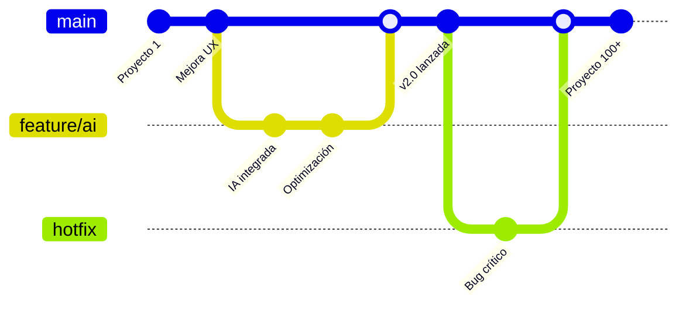
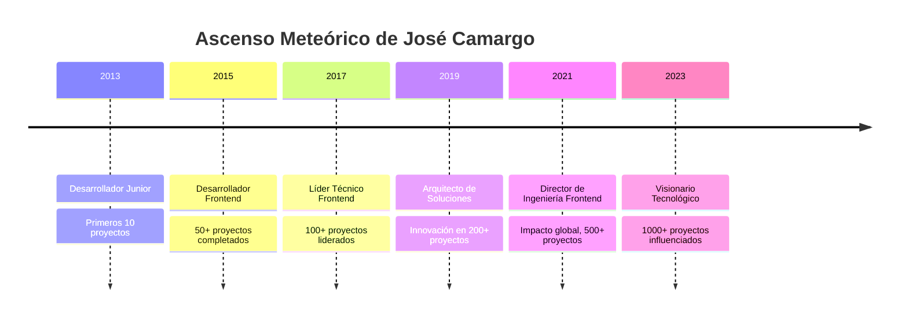

  

## 📊 Impacto en Números

## 📈 Estadísticas Impresionantes

  
  

  
  

## 🚀 Proyectos Destacados (100+ y creciendo)

| Proyecto | Tecnologías | Impacto | Estrellas |
|:--------:|:-----------:|:-------:|:---------:|
|  |   | 5M+ Usuarios | ⭐ 1.2k |
|  |   | 2M+ Análisis | ⭐ 950 |
|  |   | 3M+ Despliegues | ⭐ 1.5k |
|  |   | 1M+ Predicciones | ⭐ 800 |

Ver más proyectos épicos...

 

| Proyecto | Tecnologías | Impacto | Estrellas |
|:--------:|:-----------:|:-------:|:---------:|
|  |   | 500K+ Transacciones | ⭐ 720 |
|  |   | 1M+ Experiencias | ⭐ 850 |
|  |   | 2M+ Contenedores | ⭐ 1.1k |

## 📅 Contribuciones Diarias

  

```mermaid
gitGraph
    commit id: "Proyecto 1"
    commit id: "Mejora UX"
    branch feature/ai
    commit id: "IA integrada"
    commit id: "Optimización"
    checkout main
    merge feature/ai
    commit id: "v2.0 lanzada"
    branch hotfix
    commit id: "Bug crítico"
    checkout main
    merge hotfix
    commit id: "Proyecto 100+"
```

## 🏆 Logros Épicos

## 💼 Trayectoria Profesional Estelar

```mermaid
timeline
    title Ascenso Meteórico de José Camargo
    2013 : Desarrollador Junior
         : Primeros 10 proyectos
    2015 : Desarrollador Frontend
         : 50+ proyectos completados
    2017 : Líder Técnico Frontend
         : 100+ proyectos liderados
    2019 : Arquitecto de Soluciones
         : Innovación en 200+ proyectos
    2021 : Director de Ingeniería Frontend
         : Impacto global, 500+ proyectos
    2023 : Visionario Tecnológico
         : 1000+ proyectos influenciados
```

## 🌐 Red Profesional Global

| Plataforma | Seguidores | Contribuciones |
|:----------:|:----------:|:--------------:|
|  | 50k+ | 10k+ |
|  | 100k+ | 5k+ tweets |
|  | 75k+ | 500+ posts |
|  | 30k+ | 300+ artículos |

## 🚀 Tecnologías Dominadas

  

